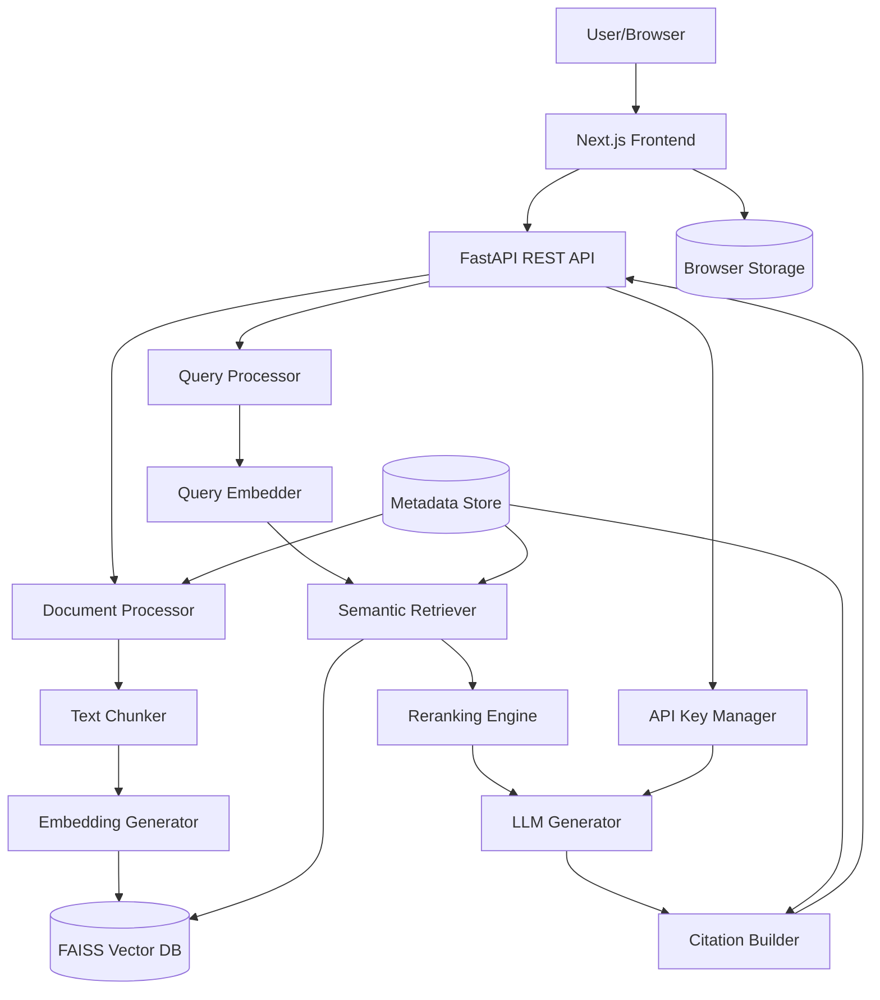

# Design Document

## Overview

The AI Knowledge Copilot is a production-grade RAG (Retrieval-Augmented Generation) system built with FastAPI, LangChain, FAISS, and Sentence Transformers. The system follows a modular architecture separating document processing, vector storage, retrieval, and generation concerns. The design emphasizes accuracy through reranking, citation tracking, and hallucination control mechanisms.

The system processes documents through a pipeline: ingestion → chunking → embedding → indexing → retrieval → reranking → generation. Each stage is independently testable and can be optimized separately.

## Architecture

### High-Level Architecture



### Component Layers

1. **Frontend Layer**: Next.js application with Tailwind CSS
2. **API Layer**: FastAPI endpoints for document management and querying
3. **Processing Layer**: Document ingestion, chunking, and embedding
4. **Storage Layer**: FAISS vector index and metadata storage
5. **Retrieval Layer**: Semantic search and reranking
6. **Generation Layer**: LLM-based answer generation with citations

### Data Flow

**Document Ingestion Flow:**
```
PDF/Web Content → Text Extraction → Chunking → Embedding → FAISS Index + Metadata Store
```

**Query Flow:**
```
User Query → Query Embedding → Similarity Search → Reranking → Context Assembly → LLM Generation → Citation Attachment → Response
```

## Components and Interfaces

### Frontend Components (Next.js + Tailwind CSS)

#### 1. Layout Components

**MainLayout**
- Responsive navigation bar with logo and menu
- Sidebar for navigation (Home, Documents, Settings, History)
- Main content area
- Footer with system status

**Sidebar**
- Navigation links to different pages
- Active route highlighting
- Collapsible on mobile

#### 2. Page Components

**HomePage (/)** 
- Hero section with system description
- Quick start guide
- Recent queries display
- Upload document shortcut

**QueryPage (/query)**
- Query input textarea with submit button
- Real-time answer display area
- Citations panel showing sources
- Loading states during processing
- Error message display

**DocumentsPage (/documents)**
- Document list with cards/table view
- Upload button with drag-and-drop zone
- Document metadata display (name, date, type, chunks)
- Delete and view actions
- Search and filter controls

**SettingsPage (/settings)**
- API key management form
- LLM provider selection (OpenAI / Open-source)
- Model configuration options
- Save and test connection buttons
- Security notice about key storage

**HistoryPage (/history)**
- Chronological list of past queries
- Expandable query cards showing full answers
- Clear history button
- Export history option

#### 3. UI Components

**DocumentUploadZone**
- Drag-and-drop file upload area
- File type validation (PDF only)
- Upload progress bar
- Success/error feedback

**QueryInput**
- Textarea with character count
- Submit button with loading state
- Example queries for guidance
- Voice input option (future enhancement)

**AnswerDisplay**
- Formatted answer text with markdown support
- Citation badges linked to sources
- Copy to clipboard button
- Confidence indicator

**CitationCard**
- Document name and page number
- Relevant excerpt preview
- Click to view full document
- Visual indicator of citation usage

**DocumentCard**
- Document thumbnail/icon
- Metadata (name, date, size, chunks)
- Action buttons (view, delete)
- Processing status indicator

**ProgressIndicator**
- Multi-stage progress bar (extract → chunk → embed → index)
- Current stage highlighting
- Estimated time remaining
- Cancel operation button

**APIKeyForm**
- Secure input fields for API keys (masked)
- Provider selection dropdown
- Model parameter inputs
- Test connection button
- Save button with confirmation

#### 4. Utility Components

**LoadingSpinner** - Animated loading indicator
**ErrorBoundary** - Catch and display React errors
**Toast** - Notification system for success/error messages
**Modal** - Reusable modal dialog
**ConfirmDialog** - Confirmation prompts for destructive actions

### Backend Components

### 1. Document Processor

**Responsibilities:**
- Extract text from PDFs using PyPDF2 or pdfplumber
- Fetch and parse web content using requests/BeautifulSoup
- Handle various document formats
- Coordinate chunking and indexing pipeline

**Interface:**
```python
class DocumentProcessor:
    def process_pdf(self, file_path: str) -> Document
    def process_url(self, url: str) -> Document
    def extract_text(self, source: Any) -> str
```

### 2. Text Chunker

**Responsibilities:**
- Split documents into overlapping chunks
- Preserve context across chunk boundaries
- Maintain metadata (source, page, position)
- Support configurable chunk size and overlap

**Interface:**
```python
class TextChunker:
    def __init__(self, chunk_size: int = 512, overlap: int = 50)
    def chunk_text(self, text: str, metadata: dict) -> List[Chunk]
    def chunk_with_overlap(self, text: str) -> List[str]
```

**Configuration:**
- Default chunk size: 512 tokens
- Default overlap: 50 tokens
- Metadata: document_id, source, page_number, chunk_index

### 3. Embedding Generator

**Responsibilities:**
- Generate embeddings using Sentence Transformers
- Support multiple embedding models
- Batch processing for efficiency
- Normalize vectors for cosine similarity

**Interface:**
```python
class EmbeddingGenerator:
    def __init__(self, model_name: str = "all-MiniLM-L6-v2")
    def embed_text(self, text: str) -> np.ndarray
    def embed_batch(self, texts: List[str]) -> np.ndarray
    def get_embedding_dimension(self) -> int
```

**Model Selection:**
- Default: `all-MiniLM-L6-v2` (384 dimensions, fast)
- Alternative: `all-mpnet-base-v2` (768 dimensions, more accurate)
- Support for custom models via Hugging Face

### 4. Vector Database (FAISS)

**Responsibilities:**
- Store and index embedding vectors
- Perform efficient similarity search
- Support index persistence
- Handle index updates and deletions

**Interface:**
```python
class VectorStore:
    def __init__(self, dimension: int, index_type: str = "Flat")
    def add_vectors(self, vectors: np.ndarray, ids: List[str])
    def search(self, query_vector: np.ndarray, k: int) -> Tuple[List[float], List[str]]
    def delete_vectors(self, ids: List[str])
    def save_index(self, path: str)
    def load_index(self, path: str)
```

**FAISS Index Types:**
- Development: `IndexFlatL2` (exact search, no training needed)
- Production: `IndexIVFFlat` (faster search for large datasets)

### 5. Metadata Store

**Responsibilities:**
- Store document and chunk metadata
- Map vector IDs to source information
- Support document management operations
- Enable citation generation

**Interface:**
```python
class MetadataStore:
    def add_document(self, doc_id: str, metadata: dict)
    def add_chunk(self, chunk_id: str, metadata: dict)
    def get_chunk_metadata(self, chunk_id: str) -> dict
    def get_document_chunks(self, doc_id: str) -> List[str]
    def delete_document(self, doc_id: str)
    def list_documents(self) -> List[dict]
```

**Storage:**
- SQLite for simplicity and portability
- Schema: documents table, chunks table with foreign keys

### 6. Semantic Retriever

**Responsibilities:**
- Convert queries to embeddings
- Perform similarity search in FAISS
- Retrieve top-k relevant chunks
- Filter by similarity threshold

**Interface:**
```python
class SemanticRetriever:
    def __init__(self, vector_store: VectorStore, embedder: EmbeddingGenerator)
    def retrieve(self, query: str, k: int = 10, threshold: float = 0.5) -> List[RetrievedChunk]
    def retrieve_with_scores(self, query: str, k: int) -> List[Tuple[RetrievedChunk, float]]
```

### 7. Reranking Engine

**Responsibilities:**
- Rerank retrieved chunks by relevance
- Use cross-encoder models for accurate scoring
- Reduce false positives from initial retrieval
- Select top-n chunks for generation

**Interface:**
```python
class Reranker:
    def __init__(self, model_name: str = "cross-encoder/ms-marco-MiniLM-L-6-v2")
    def rerank(self, query: str, chunks: List[RetrievedChunk], top_n: int = 5) -> List[RetrievedChunk]
    def score_pairs(self, query: str, texts: List[str]) -> List[float]
```

**Model:**
- Default: `cross-encoder/ms-marco-MiniLM-L-6-v2`
- Cross-encoders provide better relevance than bi-encoders for reranking

### 8. LLM Generator

**Responsibilities:**
- Generate answers using retrieved context
- Support multiple LLM backends (OpenAI, Llama, Mistral)
- Implement hallucination control prompts
- Extract citations from responses

**Interface:**
```python
class LLMGenerator:
    def __init__(self, model_type: str, model_name: str)
    def generate_answer(self, query: str, context: List[RetrievedChunk]) -> str
    def generate_with_citations(self, query: str, context: List[RetrievedChunk]) -> AnswerWithCitations
```

**Prompt Template:**
```
You are a helpful assistant that answers questions based ONLY on the provided context.
If the answer cannot be found in the context, say "I don't have enough information to answer this question."
Always cite your sources using [Source: document_name, page X].

Context:
{context}

Question: {query}

Answer:
```

### 9. Citation Builder

**Responsibilities:**
- Extract source references from generated text
- Map citations to original documents
- Format citations with document name, page, excerpt
- Validate citation accuracy

**Interface:**
```python
class CitationBuilder:
    def build_citations(self, answer: str, chunks: List[RetrievedChunk]) -> List[Citation]
    def format_citation(self, chunk: RetrievedChunk) -> str
    def validate_citations(self, answer: str, citations: List[Citation]) -> bool
```

### 10. FastAPI Application

**Responsibilities:**
- Expose REST endpoints
- Handle request validation
- Coordinate pipeline components
- Manage async operations
- Handle API key management

**Endpoints:**
```python
POST /documents/upload - Upload PDF
POST /documents/url - Index web content
GET /documents - List all documents
GET /documents/{doc_id} - Get document details
DELETE /documents/{doc_id} - Delete document
POST /query - Ask a question
GET /health - Health check
POST /settings/api-key - Save API key
GET /settings/api-key - Get current provider (not the key)
POST /settings/test-connection - Test LLM connection
```

### 11. API Key Manager

**Responsibilities:**
- Securely store API keys
- Validate API keys
- Provide keys to LLM generator
- Support multiple providers
- Handle key rotation

**Interface:**
```python
class APIKeyManager:
    def save_key(self, provider: str, api_key: str, user_id: str)
    def get_key(self, provider: str, user_id: str) -> str
    def validate_key(self, provider: str, api_key: str) -> bool
    def delete_key(self, provider: str, user_id: str)
    def get_current_provider(self, user_id: str) -> str
```

**Security:**
- Keys encrypted at rest using Fernet (symmetric encryption)
- Keys never returned in API responses
- Keys stored per-user in secure storage
- Environment variable fallback for system-wide keys

## Data Models

### Document
```python
@dataclass
class Document:
    id: str
    source: str  # file path or URL
    source_type: str  # "pdf" or "web"
    text: str
    metadata: dict
    created_at: datetime
```

### Chunk
```python
@dataclass
class Chunk:
    id: str
    document_id: str
    text: str
    embedding: Optional[np.ndarray]
    metadata: dict  # page_number, chunk_index, etc.
```

### RetrievedChunk
```python
@dataclass
class RetrievedChunk:
    chunk: Chunk
    score: float
    document_name: str
    page_number: Optional[int]
```

### Citation
```python
@dataclass
class Citation:
    document_name: str
    page_number: Optional[int]
    excerpt: str
    chunk_id: str
```

### QueryResponse
```python
@dataclass
class QueryResponse:
    answer: str
    citations: List[Citation]
    retrieved_chunks: int
    confidence: float
```

### APIKeyConfig
```python
@dataclass
class APIKeyConfig:
    provider: str  # "openai" or "huggingface"
    model_name: str
    temperature: float
    max_tokens: int
```

### DocumentDetails
```python
@dataclass
class DocumentDetails:
    id: str
    name: str
    source_type: str
    upload_date: datetime
    chunk_count: int
    total_size: int
```

## Correctness Properties

*A property is a characteristic or behavior that should hold true across all valid executions of a system—essentially, a formal statement about what the system should do. Properties serve as the bridge between human-readable specifications and machine-verifiable correctness guarantees.*


### Property 1: Text extraction completeness
*For any* valid PDF document with text content, extracting text should return non-empty content that includes text from all pages.
**Validates: Requirements 1.1**

### Property 2: Document independence
*For any* set of uploaded documents, each document should be tracked with a unique ID and processed independently without interference.
**Validates: Requirements 1.5**

### Property 3: Chunk size constraint
*For any* document and configured chunk size, all generated chunks (except possibly the last) should not exceed the specified size.
**Validates: Requirements 2.1**

### Property 4: Chunk overlap preservation
*For any* two consecutive chunks from the same document, there should be overlapping text content of approximately the configured overlap size.
**Validates: Requirements 2.2**

### Property 5: Chunk metadata completeness
*For any* generated chunk, the metadata should contain document_id, source information, and chunk_index fields.
**Validates: Requirements 2.3**

### Property 6: Embedding generation completeness
*For any* chunk, an embedding vector should be generated with dimension matching the embedding model's output dimension.
**Validates: Requirements 2.4**

### Property 7: Vector storage round-trip
*For any* embedding stored in the vector database with an ID, retrieving by that ID should return the same embedding (within floating-point precision).
**Validates: Requirements 2.5**

### Property 8: Query embedding dimension consistency
*For any* query string, the generated embedding should have the same dimension as document embeddings.
**Validates: Requirements 3.1**

### Property 9: Top-k retrieval count
*For any* query and k value, the number of retrieved chunks should be min(k, total_chunks_in_index).
**Validates: Requirements 3.3**

### Property 10: Retrieval score ordering
*For any* retrieval results, the similarity scores should be in non-increasing order (highest similarity first).
**Validates: Requirements 3.4**

### Property 11: Reranking score assignment
*For any* set of chunks and query passed to reranking, each chunk should receive a reranking score.
**Validates: Requirements 4.2**

### Property 12: Reranking score ordering
*For any* reranked results, the reranking scores should be in non-increasing order (highest relevance first).
**Validates: Requirements 4.3**

### Property 13: Top-n selection after reranking
*For any* reranked results and n value, exactly min(n, len(results)) chunks should be selected for generation.
**Validates: Requirements 4.4**

### Property 14: Metadata preservation through reranking
*For any* chunk, the metadata before and after reranking should be identical (reranking is an invariant operation on metadata).
**Validates: Requirements 4.5**

### Property 15: Prompt construction completeness
*For any* query and context chunks, the constructed prompt should contain both the query text and all context chunk texts.
**Validates: Requirements 5.1**

### Property 16: Citation presence in responses
*For any* generated answer based on context, the response should contain at least one citation marker or explicit statement of insufficient information.
**Validates: Requirements 5.2**

### Property 17: Citation field completeness
*For any* citation in a response, it should include document_name and excerpt fields at minimum.
**Validates: Requirements 5.3**

### Property 18: Multiple source citation
*For any* answer generated from multiple chunks, citations should reference all chunks used in the context.
**Validates: Requirements 5.5**

### Property 19: Grounding instruction presence
*For any* generation request, the system prompt should contain instructions to answer only from provided context.
**Validates: Requirements 6.1**

### Property 20: Low confidence indication
*For any* query where the highest similarity score is below a threshold (e.g., 0.3), the response should indicate uncertainty or insufficient information.
**Validates: Requirements 6.3**

### Property 21: Web content extraction
*For any* valid HTTP/HTTPS URL that returns HTML, the system should extract non-empty text content.
**Validates: Requirements 7.1**

### Property 22: Web content pipeline consistency
*For any* web content, it should be chunked and embedded using the same functions as PDF content.
**Validates: Requirements 7.2**

### Property 23: Web content metadata preservation
*For any* chunk created from web content, the metadata should contain the source URL.
**Validates: Requirements 7.4**

### Property 24: URL processing independence
*For any* set of URLs, each should be processed into separate documents with unique IDs.
**Validates: Requirements 7.5**

### Property 25: API input validation
*For any* invalid API request (missing required fields, wrong types), the response should have a 4xx status code and error message.
**Validates: Requirements 8.2**

### Property 26: API response format
*For any* successful API response, it should have a 2xx status code and valid JSON body.
**Validates: Requirements 8.4**

### Property 27: FAISS index persistence round-trip
*For any* FAISS index with vectors, saving to disk and reloading should preserve all vectors and enable identical search results.
**Validates: Requirements 9.4**

### Property 28: Model configuration acceptance
*For any* valid model configuration (OpenAI or open-source), the system should initialize without errors.
**Validates: Requirements 10.1**

### Property 29: Model interface consistency
*For any* configured model type, the generation interface should accept the same input format (query + context) and return the same output format.
**Validates: Requirements 10.4**

### Property 30: Document deletion completeness
*For any* document, after deletion, searching for its chunks should return zero results.
**Validates: Requirements 11.1**

### Property 31: Document listing completeness
*For any* set of indexed documents, the list operation should return all document IDs.
**Validates: Requirements 11.2**

### Property 32: Document update replacement
*For any* document that is updated, the old version's chunks should be removed and new version's chunks should be searchable.
**Validates: Requirements 11.3**

### Property 33: Metadata-vector consistency
*For any* operation (add, delete, update), the set of chunk IDs in metadata storage should match the set of vector IDs in FAISS.
**Validates: Requirements 11.5**

### Property 34: Error logging completeness
*For any* caught exception, the logs should contain the exception type, message, and stack trace.
**Validates: Requirements 12.1**

### Property 35: Operation logging
*For any* document upload or query request, the logs should contain an entry with operation type and timestamp.
**Validates: Requirements 12.2**

### Property 36: Exception handling gracefully
*For any* exception during request processing, the system should return an error response rather than crashing.
**Validates: Requirements 12.3**

### Property 37: Frontend displays upload status
*For any* document upload through the UI, the frontend should display status updates during processing.
**Validates: Requirements 13.2**

### Property 38: Frontend displays answers with citations
*For any* query response, the frontend should render both the answer text and all citations in a readable format.
**Validates: Requirements 13.3**

### Property 39: API key validation
*For any* API key submitted through settings, the system should validate it before storing.
**Validates: Requirements 14.2**

### Property 40: API key persistence
*For any* saved API key, subsequent requests should use that key for LLM generation.
**Validates: Requirements 14.4**

### Property 41: Document list completeness in UI
*For any* set of indexed documents, the documents page should display all documents with their metadata.
**Validates: Requirements 15.1, 15.2**

### Property 42: Query history persistence
*For any* submitted query, it should be stored in browser local storage and retrievable in history.
**Validates: Requirements 16.1, 16.2**

## Error Handling

### Error Categories

1. **Input Errors** (4xx responses)
   - Invalid file format
   - Missing required parameters
   - Malformed URLs
   - Invalid document IDs

2. **Processing Errors** (5xx responses)
   - PDF extraction failures
   - Embedding generation failures
   - FAISS index errors
   - LLM API failures

3. **Resource Errors**
   - Out of memory
   - Disk space exhausted
   - API rate limits

### Error Handling Strategy

**Graceful Degradation:**
- If reranking fails, fall back to initial retrieval results
- If citation extraction fails, return answer without citations
- If web scraping fails, provide clear error message

**Retry Logic:**
- LLM API calls: 3 retries with exponential backoff
- Web requests: 2 retries with 1-second delay
- No retries for user input errors

**Logging:**
- All errors logged with full context
- Stack traces for unexpected errors
- User-facing errors sanitized (no internal details)

**Validation:**
- Input validation at API boundary
- Type checking with Pydantic models
- File size limits (e.g., 50MB per PDF)

## Testing Strategy

### Unit Testing

**Backend Framework:** pytest
**Frontend Framework:** Jest + React Testing Library

**Backend Coverage Areas:**
- Text extraction from PDFs
- Chunking logic with various text sizes
- Embedding generation
- FAISS index operations
- Metadata storage CRUD operations
- API endpoint validation
- Citation extraction and formatting
- API key encryption/decryption

**Frontend Coverage Areas:**
- Component rendering
- Form validation
- API integration
- Local storage operations
- Error handling
- User interactions (clicks, form submissions)

**Example Unit Tests:**
- Test chunking with text shorter than chunk size
- Test chunking with exact chunk size multiples
- Test overlap calculation at document boundaries
- Test FAISS index with single vector
- Test metadata retrieval for non-existent IDs
- Test API error responses for invalid inputs
- Test DocumentCard component renders metadata correctly
- Test APIKeyForm validates input before submission
- Test QueryInput handles empty submissions

### Property-Based Testing

**Framework:** Hypothesis (Python)

**Configuration:**
- Minimum 100 iterations per property test
- Use `@given` decorators with appropriate strategies
- Each test tagged with: `# Feature: ai-knowledge-copilot, Property X: [property text]`

**Test Generators:**
- Random text documents (varying lengths)
- Random chunk sizes (128-1024 tokens)
- Random overlap sizes (10-100 tokens)
- Random embedding vectors (matching model dimensions)
- Random queries (1-100 words)
- Random k values (1-50)

**Property Test Examples:**

```python
# Feature: ai-knowledge-copilot, Property 3: Chunk size constraint
@given(text=st.text(min_size=100), chunk_size=st.integers(min_value=50, max_value=500))
def test_chunk_size_constraint(text, chunk_size):
    chunks = chunker.chunk_text(text, chunk_size)
    for chunk in chunks[:-1]:  # All except last
        assert len(chunk) <= chunk_size

# Feature: ai-knowledge-copilot, Property 10: Retrieval score ordering
@given(query=st.text(min_size=1), k=st.integers(min_value=1, max_value=20))
def test_retrieval_score_ordering(query, k):
    results = retriever.retrieve(query, k)
    scores = [r.score for r in results]
    assert scores == sorted(scores, reverse=True)
```

**Property Test Coverage:**
- All 36 correctness properties should have corresponding property tests
- Focus on invariants (metadata preservation, consistency)
- Test round-trip properties (storage/retrieval, serialization)
- Test ordering properties (score sorting)
- Test boundary conditions through generators

### Integration Testing

**Scope:**
- End-to-end document upload → query → response flow
- Multi-document scenarios
- Model switching (OpenAI ↔ open-source)
- Error recovery scenarios
- Frontend-backend integration
- API key management flow

**Test Scenarios:**
- Upload PDF, query it, verify citations
- Upload multiple documents, query across them
- Delete document, verify it's not retrieved
- Switch models, verify consistent behavior
- Save API key in UI, verify it's used for queries
- Upload document through UI, verify it appears in documents list
- Submit query through UI, verify answer displays with citations

### Manual Testing

**User Acceptance:**
- Test with real PDFs (research papers, documentation)
- Verify answer quality and citation accuracy
- Test edge cases (very long documents, complex queries)
- Performance testing with large document collections

## Implementation Notes

### Technology Stack

**Backend Dependencies:**
```
fastapi==0.104.1
uvicorn==0.24.0
langchain==0.1.0
sentence-transformers==2.2.2
faiss-cpu==1.7.4  # or faiss-gpu for production
pydantic==2.5.0
python-multipart==0.0.6
cryptography==41.0.7  # for API key encryption
```

**Frontend Dependencies:**
```
next==14.0.4
react==18.2.0
react-dom==18.2.0
tailwindcss==3.3.0
axios==1.6.2
react-query==3.39.3  # for API state management
zustand==4.4.7  # for global state
react-dropzone==14.2.3  # for file uploads
react-markdown==9.0.1  # for rendering answers
```

**Document Processing:**
```
pypdf2==3.0.1
pdfplumber==0.10.3
beautifulsoup4==4.12.2
requests==2.31.0
```

**LLM Integration:**
```
openai==1.3.0
transformers==4.35.0
torch==2.1.0  # for local models
```

**Testing:**
```
# Backend
pytest==7.4.3
hypothesis==6.92.0
pytest-asyncio==0.21.1

# Frontend
jest==29.7.0
@testing-library/react==14.1.2
@testing-library/jest-dom==6.1.5
```

### Performance Considerations

**Embedding Generation:**
- Batch embeddings for efficiency (batch size: 32)
- Cache embeddings to avoid recomputation
- Use GPU if available for Sentence Transformers

**FAISS Index:**
- Start with IndexFlatL2 for simplicity
- Switch to IndexIVFFlat when index > 10,000 vectors
- Use IndexIVFPQ for very large collections (> 1M vectors)

**API Performance:**
- Async endpoints for I/O-bound operations
- Connection pooling for database
- Rate limiting to prevent abuse

**Memory Management:**
- Stream large PDFs instead of loading entirely
- Limit concurrent document processing
- Clear embedding cache periodically

### Security Considerations

**Input Validation:**
- File type verification (not just extension)
- File size limits
- URL whitelist/blacklist for web scraping
- Sanitize user inputs to prevent injection

**API Security:**
- API key authentication
- Rate limiting per user
- CORS configuration
- Input sanitization

**Data Privacy:**
- No logging of document content
- Secure storage of API keys
- Option to clear all user data

### Deployment Architecture

**Development:**
- SQLite for metadata
- Local FAISS index files
- CPU-based embeddings

**Production:**
- PostgreSQL for metadata
- Distributed FAISS or vector DB (Pinecone/Weaviate)
- GPU-based embeddings
- Load balancer for API
- Redis for caching

### Configuration Management

**Backend Environment Variables:**
```
EMBEDDING_MODEL=all-MiniLM-L6-v2
LLM_PROVIDER=openai  # or huggingface
OPENAI_API_KEY=sk-...  # fallback if not set by user
CHUNK_SIZE=512
CHUNK_OVERLAP=50
TOP_K_RETRIEVAL=10
TOP_N_RERANK=5
FAISS_INDEX_PATH=./data/faiss_index
METADATA_DB_PATH=./data/metadata.db
ENCRYPTION_KEY=<generated-key>  # for API key encryption
CORS_ORIGINS=http://localhost:3000  # frontend URL
```

**Frontend Environment Variables:**
```
NEXT_PUBLIC_API_URL=http://localhost:8000
NEXT_PUBLIC_APP_NAME=AI Knowledge Copilot
```

**Config File (config.yaml):**
```yaml
embedding:
  model: all-MiniLM-L6-v2
  batch_size: 32
  
chunking:
  size: 512
  overlap: 50
  
retrieval:
  top_k: 10
  similarity_threshold: 0.5
  
reranking:
  enabled: true
  model: cross-encoder/ms-marco-MiniLM-L-6-v2
  top_n: 5
  
llm:
  provider: openai
  model: gpt-3.5-turbo
  temperature: 0.1
  max_tokens: 500
  
security:
  max_file_size_mb: 50
  allowed_origins:
    - http://localhost:3000
    - https://yourdomain.com
```

## Future Enhancements

1. **Multi-modal Support**: Process images and tables from PDFs
2. **Conversational Memory**: Track conversation history for follow-up questions
3. **Query Expansion**: Automatically expand queries with synonyms
4. **Hybrid Search**: Combine semantic search with keyword search (BM25)
5. **Streaming Responses**: Stream LLM responses for better UX
6. **Document Summarization**: Generate summaries of indexed documents
7. **Multi-language Support**: Support non-English documents
8. **Fine-tuned Embeddings**: Train custom embeddings on domain-specific data
9. **Advanced Citations**: Link to specific sentences/paragraphs in source
10. **Feedback Loop**: Learn from user feedback to improve retrieval
